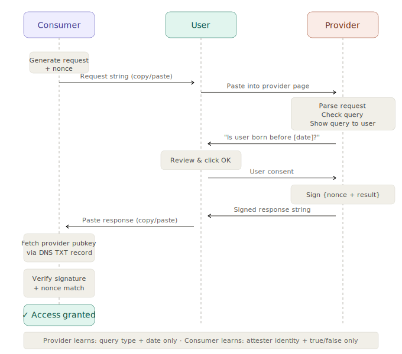

# Kyuix Age Verification POC

## Know Your Customer is X

This repository contains a proof of concept for less-invasive personal-detail
verification between two parties:

- `identity-consumer`: creates an identity request and verifies a signed yes/no
  response against a DNS-published public key.
- `identity-provider`: evaluates the request against a local demo subject
  profile, shows the computed answer, and signs the response after consent.

## Attestation flow



## Project layout

- `apps/identity-consumer`: Next.js consumer app on port `3000`
- `apps/identity-provider`: Next.js provider app on port `3001`
- `packages/protocol`: shared request/response schema, DSL, serialization, and
  evaluator helpers
- `packages/crypto`: Ed25519 signing, verification, and DNS TXT resolution
- `docs/dns-setup.md`: key generation and DNS publication guide

## Request and response format

The request token is base64url-encoded JSON containing:

- `requestId`
- `issuerDomain`
- `createdAt`
- `subject`
- `displayText`

The POC implements a constrained subject expression:

- `bornOnOrBefore(subject.dateOfBirth, <cutoff-date>)`

That allows the consumer to ask questions like:

- "Is the subject at least 18 years old?"

The response token is base64url-encoded JSON containing:

- `requestId`
- `providerDomain`
- `dnsRecordName`
- `subjectAnswer`
- `issuedAt`
- `displayText`
- `signatureAlgorithm`
- `signature`

The provider signs the canonical JSON payload using Ed25519. The consumer
resolves the provider public key from DNS TXT and verifies that signature before
accepting the response as proof.

## Local development

Install dependencies for both apps:

```bash
cd apps/identity-consumer && npm install
cd ../identity-provider && npm install
```

Run the apps in separate terminals:

```bash
cd apps/identity-consumer && npm run dev
```

```bash
cd apps/identity-provider && npm run dev
```

Or use Docker Compose after creating a `.env` file from `.env.example`:

```bash
docker compose up --build
```

## Required provider configuration

Before the provider can sign valid responses, generate a keypair:

```bash
npm run generate:provider-keys
```

Then:

1. Set `PROVIDER_PRIVATE_KEY_PKCS8_BASE64` in `.env`.
2. Set `PROVIDER_DOMAIN` to the real domain that will publish the TXT record.
3. Publish the generated `DNS_TXT_VALUE` at `_kyuix-idp.<provider-domain>`.

See [DNS setup](docs/dns-setup.md) for the exact record format.

## Demo flow

1. Open the consumer app and create an age verification request.
2. Copy the request token.
3. Open the provider app and paste the request token.
4. Review the computed answer and confirm consent.
5. Copy the signed response token.
6. Return to the consumer app and paste the response token.
7. Verify the response. The consumer will:
   - confirm the request ID is known,
   - resolve `_kyuix-idp.<provider-domain>` from DNS,
   - validate the Ed25519 signature,
   - store the result in the local audit log.

## Default environment variables

```env
COMPOSE_BUILD_CONTEXT=.
CONSUMER_DOMAIN=consumer.localtest.me
PROVIDER_DOMAIN=provider.example.com
PROVIDER_PRIVATE_KEY_PKCS8_BASE64=
DEMO_SUBJECT_DOB=1998-04-12
```

## Dokploy note

If Dokploy checks out the repository into a `code/` subdirectory but executes the
compose file from the parent deployment directory, set:

```env
COMPOSE_BUILD_CONTEXT=./code
```

This makes the compose `build.context` point at the cloned repository instead of
Dokploy's wrapper directory.

## Notes and limitations

- The provider currently evaluates a single demo subject profile.
- The request DSL intentionally supports only one atomic age-related predicate.
- Audit persistence in the consumer is JSON-file based and intended only for the
  POC.
- The consumer performs real DNS TXT lookups, so full end-to-end verification
  requires a real public domain with the expected record.
